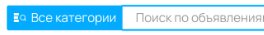
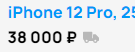
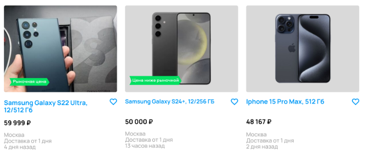
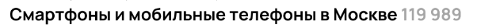
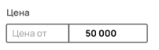
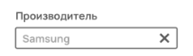

### Общие баги
- Опечатка в логотипе A**W**ito ***high***

- Отсутствует кнопка toggle для пункта сортировки "Сначала из Москвы" ***high***

- Может быть придирка, но нет отступа между select'ом категорий и строкой поиска ***low***

- Отстутсвует иконка у карточки товара, что возможна доставка ***low***

- Что такое "Соколдо" в последнем товаре??? 

### Баги в зависимости от ситуации
Будем считать, что пользователь выбрал фильтры и нажал на кнопку "***Показать n объявлений***"

*Тогда:*

- Несоответствие счетчика объявлений в заголовке и на кнопке подтверждения применения фильтров (119 989 vs 77) ***medium***

В отфильтрованном списке:

- Цена выбрана до 50 000, на второй строке присутствует ценник 59 999 ***high***

- Присутствуют товары иного производителя - Apple (на второй строке), выбран Samsung ***medium***

- Объем памяти выбран 512 ГБ, в списке присутствует S24+ с объемом памяти 256 ГБ на второй строке ***low***

- Цвет выбран синий, в списке присутствуют черные смарфоны на второй строке ***low***

*Иначе,* если пользователь только выбрал фильтры, но не подтвердил нажатием на кнопку "***Показать n объявлений***":
- Всё корректно, неизвестно какие фильтры были до изменения