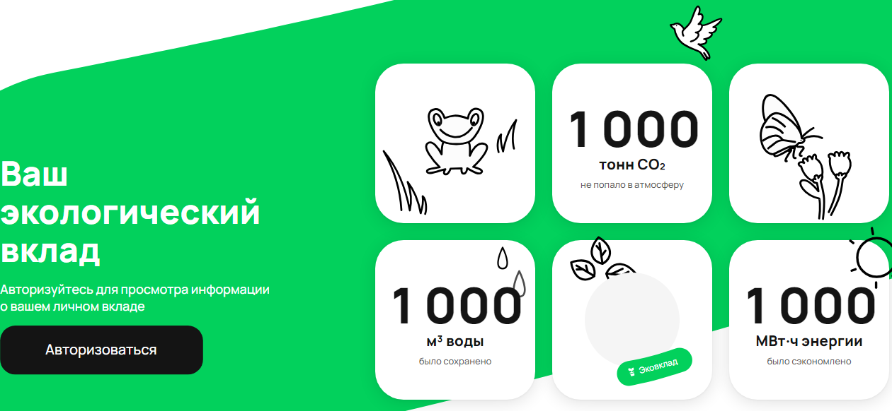

### ID 1
#### Описание
Перекрытие div .desktop-label-EIkG9 в счетчике сэкономленной энергии при изменении единиц измерения на млн кВт, млн МВт, млрд МВт
#### Серьезность бага
**S1** Minor
#### Приоритет
**P3** Low

#### Шаги к воспроизведению
Получение с бэкенда значения в *init.json*  result.blocks.personalImpact.data.**energy** >= 1 000 000
#### Фактический результат
Перекрытие div .desktop-label-EIkG9
#### Ожидаемый результат
Корректное отображение лейблов без перекрытия и наложения
#### Дополнения

### ID 2
#### Описание
Округление числа в счетчике без необходимости
#### Серьезность бага
**S2** Major
#### Приоритет
**P2** Medium

#### Шаги к воспроизведению
Получение с бэкенда значений в *init.json*  result.blocks.personalImpact.data.**energy**, result.blocks.personalImpact.data.**co2** или result.blocks.personalImpact.data.**water** последнего значения из граничащих для каждого класса эквивалентности (единицы измерения, подробнее в [TESTCASES.md](TESTCASES.md)): 999 999, 999 999 999, 999 999 999 999
#### Фактический результат
Округление до ближайшего числа большей разрядности: 1 000 и т.д.
#### Ожидаемый результат
Округление до сотых, число с плавающей запятой: 999,9 и тд.
#### Дополнения

### ID 3
#### Описание
Выход чисел за пределы допустимых значений
#### Серьезность бага
**S2** Major
#### Приоритет
**P1** High

#### Шаги к воспроизведению
Получение с бэкенда значений в *init.json*  result.blocks.personalImpact.data.**energy**, result.blocks.personalImpact.data.**co2** или result.blocks.personalImpact.data.**water** первого и последнего значения, из тест-кейсов 1.1 и 5.4 ([TESTCASES.md](TESTCASES.md)): -1 и 9 999 999 999 999
#### Фактический результат
Отображение невозможных значений, для тест-кейса 1.1 отрицательные значения, для тест-кейса 5.4 округленное значение без единиц измерения
#### Ожидаемый результат
Округление до ближайшего порогового значения или заглушка о некорректности данных
#### Дополнения

